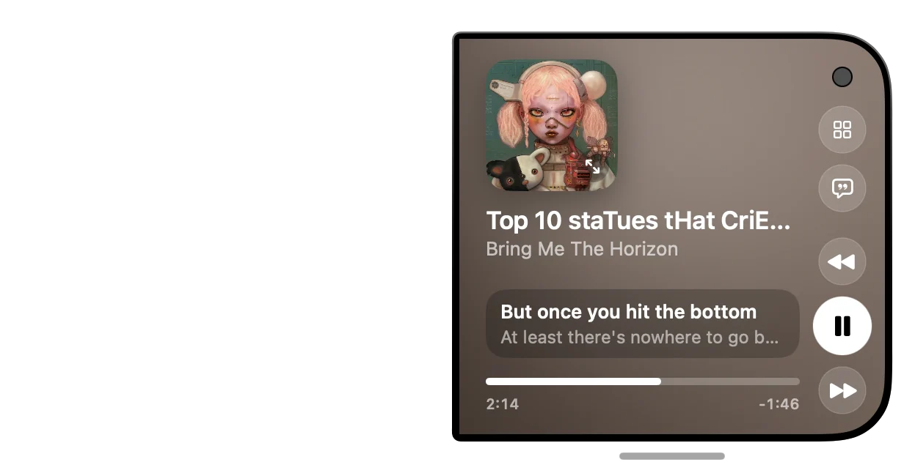
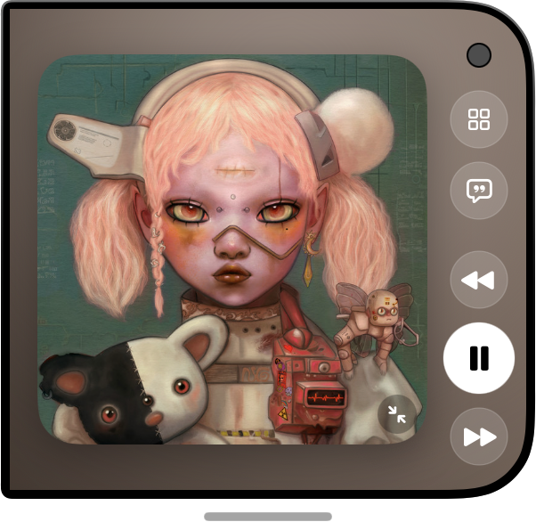
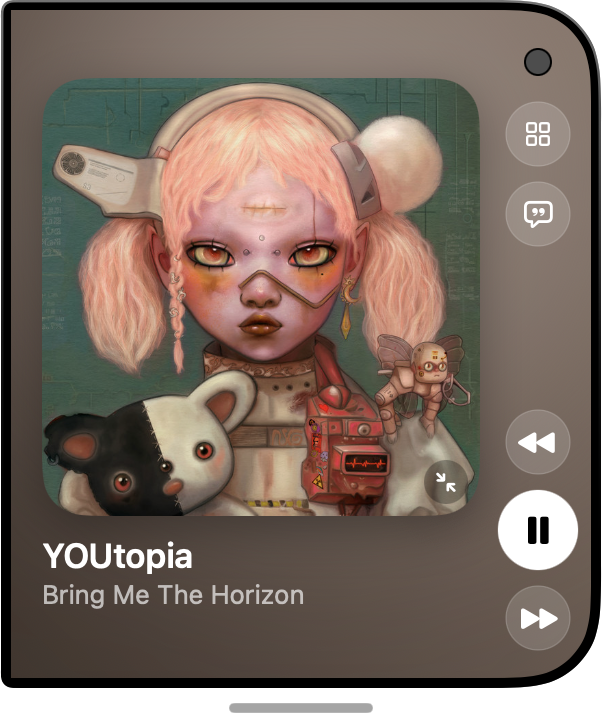

# Duo Player

A floating, iPhone Duo-style Spotify player for macOS. It stays on top of your other windows, folds open into two screens, and controls whatever Spotify is playing through the Spotify Web API.



## Setup

Duo Player talks to Spotify through **your own Spotify app** (a free "client ID"). Each build uses its own ID, so you don't share rate limits, or anything else, with anyone.

You need macOS 15 or later, the Xcode Command Line Tools (`xcode-select --install`), and Spotify Premium for playback control.

### 1. Set up your Spotify app

1. Go to the [Spotify Developer Dashboard](https://developer.spotify.com/dashboard) and log in with your Spotify account.
2. Click **Create app**, then fill in:
   - **App name:** anything, e.g. `Duo Player`.
   - **App description:** anything.
   - **Redirect URI:** `http://127.0.0.1:8898/callback`, typed exactly and then **Add**.
   - **Which API/SDKs are you planning to use?** Tick **Web API**.
3. Accept the terms and click **Save**.
4. Open the app's **Settings** and copy the **Client ID** (32 letters and numbers). You don't need the client secret, because Duo Player uses PKCE sign-in.
5. New apps are in **development mode**, where only listed accounts can sign in. Under **User Management**, add the email of every Spotify account that will use this build, including your own if it isn't the app's owner.

### 2. Build

```bash
./build.sh
```

The first time, it asks for your Client ID and saves it in `.spotify-client-id`. That file is git-ignored, so your ID never gets committed. Later builds reuse it. You can also pass the ID directly, which saves it too:

```bash
SPOTIFY_CLIENT_ID=your_client_id ./build.sh
```

To switch to a different ID, delete `.spotify-client-id` or pass a new `SPOTIFY_CLIENT_ID`.

### 3. Run and sign in

```bash
open "build/Duo Player.app"
```

After a short boot splash, click **Log in with Spotify**. Your browser opens Spotify's sign-in page. Approve access, and the player shows what's playing. Start playback on any device (the Spotify app, web player, or a speaker) if nothing shows.

### Troubleshooting

- **`INVALID_CLIENT: Invalid redirect URI`**: the Redirect URI in your Spotify app must be exactly `http://127.0.0.1:8898/callback`. Not `localhost`, and no trailing slash.
- **Sign-in page says your account isn't allowed**, or you get a 403 after signing in: add your account's email under **User Management** (step 1.5).
- **"No Spotify client ID"** in the app: it wasn't built with `./build.sh`. Rebuild with it.
- **"Spotify needs a breather"**: you've hit Spotify's rate limit. See [Spotify rate limits](#spotify-rate-limits) below.

## Features

### Now Playing (folded)


The compact, folded view:
- **Album art**: click it (or the ⤢ badge) to unfold.
- **Title / artist**: click to open the list the song is playing from (see *Playing From* below).
- **Live lyric line**: the current synced lyric line, with the next line under it.
- **Scrubber**: drag to seek. Shows elapsed and remaining time.
- **Side controls**: Library (grid), Lyrics (bubble), Previous, Play/Pause, and Next.
- **Grab bar**: the pill under the window switches between the normal and tall sizes.

### Now Playing: full album art


Click the album art (or the ⤢ badge) to expand it until it fills the screen. Click it again, or the ⤡ badge, to shrink it back.

### Library: Albums


The grid button unfolds a second screen on the left. **Albums** shows your saved albums, with the most recent one large. Click any album to play it.

### Library: Playlists


Your Spotify playlists. Click one to play it.

### Up Next


Spotify's queue, with repeats removed so each song appears once. Click a song to jump to it. Spotify has no "jump into the queue" call, so the app presses Next the right number of times, counted against Spotify's real queue. On repeat-one, clicking the current song restarts it.

### Profile


The person button shows your Spotify account (avatar, name, followers), a **Sign out** button, and your **Top artists**. Click an artist to play them.

### Lyrics


The bubble button shows full synced lyrics on the left screen. The current line is highlighted, and the lines around it fade out. If no lyrics are found automatically, they are searched for by title and artist.

### Playing From (album / playlist)


Clicking the song title lists every track in the album or playlist that is playing. The current track is highlighted, and you can click any row to play it in that context. If Spotify won't share a playlist with developer-mode apps (for example, its own mixes), the list shows the song's album instead. The back arrow returns to the tab you came from.

### Tall size




Drag the grab bar down, or click it, to add one more album row of height, which is closer to the real Duo proportions. Drag it up to go back. The tall size works both unfolded (top) and folded (bottom). When folded, the extra height gives the full album art room for the title and artist underneath.

## Notes
- Needs Spotify Premium for playback control (a Web API limit).
- The app runs as a Spotify developer-mode app, so some Spotify-owned playlists can't be read.

## Spotify rate limits

Spotify limits how many requests an app can make in a rolling 30-second window. Apps in **development mode**, like this one by default, get a much lower limit than apps approved for extended quota. When the limit is hit, Spotify answers `429 Too Many Requests` with a `Retry-After` header. That wait can be long: we've seen about 12 hours. See Spotify's [rate limits guide](https://developer.spotify.com/documentation/web-api/concepts/rate-limits).

What Duo Player does about it:
- **Polls "now playing" sparingly** instead of every second. It checks every 10 seconds while playing, plus right when the current song should end so the next one shows on time. It checks every 30 seconds while paused, about a second after you press a playback button, and not at all while the screen is asleep or locked. Between checks the progress bar and lyrics run on a local clock and buttons update instantly, so it still feels live. The trade-off is that a change made on another device can take up to 10 seconds to show.
- **Caches your library.** Profile, albums, playlists and top artists are saved to `~/Library/Caches/DuoPlayer/library.json`, shown immediately on launch, and refreshed from Spotify only when the saved copy is more than 6 hours old. Relaunching doesn't re-download everything. Signing out deletes the cache.
- **Retries missing data at most once a minute** instead of on every poll.
- **Caches the rest of the `/me` calls in memory.** `/me/*` endpoints can return 429 after only a handful of calls, so the app stores recent answers:
  - devices for 5 minutes;
  - whether a song is liked for 1 hour, cleared when you like or unlike;
  - playlist and album track lists for 1 hour. If a list can't load, the current song is shown as a placeholder.

  The queue is fetched only while the Up next tab is on screen, not on every song change.
- **Honors `Retry-After`.** While limited, the player shows a countdown to the next try, and the Albums and Lyrics buttons are disabled. Playback in Spotify itself is unaffected.

If you get rate limited anyway:
- **Wait for the countdown.** Relaunching the app won't help.
- **Avoid restarting the app over and over.**
- **Switching client ID may not lift a long block.** In one test, after an hours-long `Retry-After`, a newly created client ID was refused on `/me/player` with the same end time. Spotify doesn't document why, so wait it out.
- **Keep your client ID to yourself.** Limits apply per app (client ID), across all its users, so sharing one ID between many people uses them up faster. That's why `build.sh` uses your own ID (see [Setup](#setup)). For heavy use, apply for extended quota mode in the Spotify Developer Dashboard.
