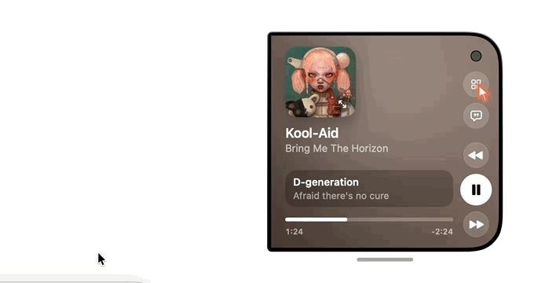
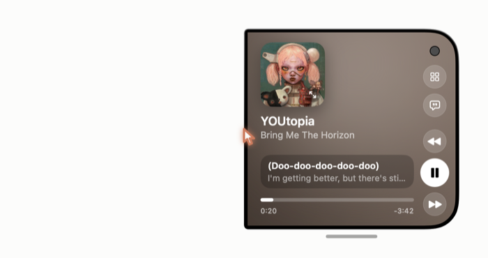
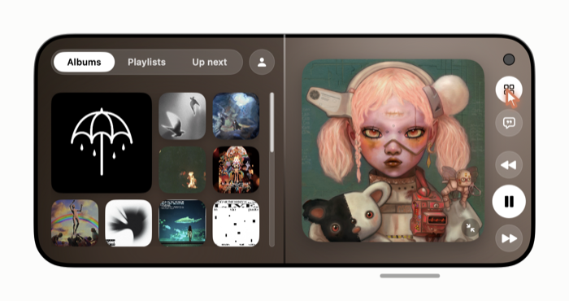
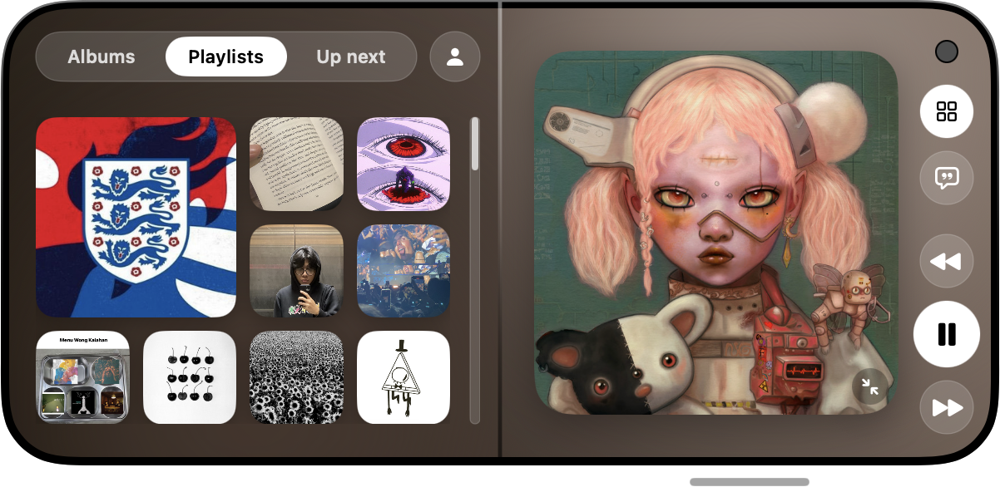
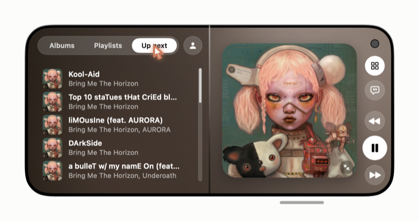
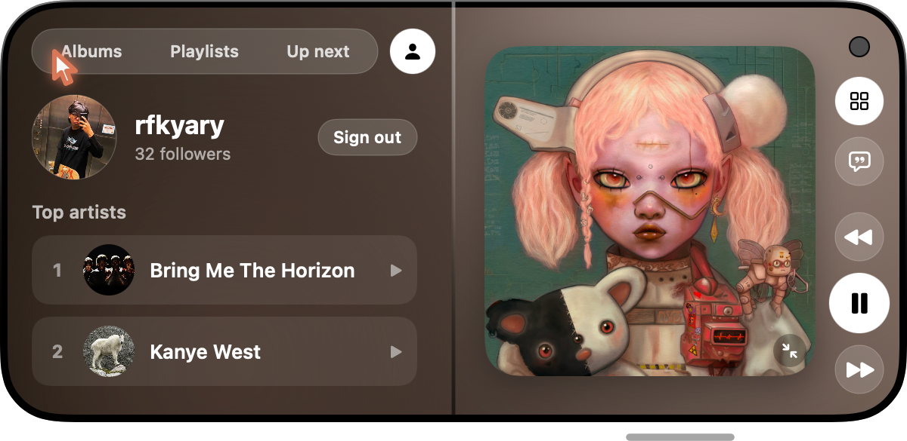
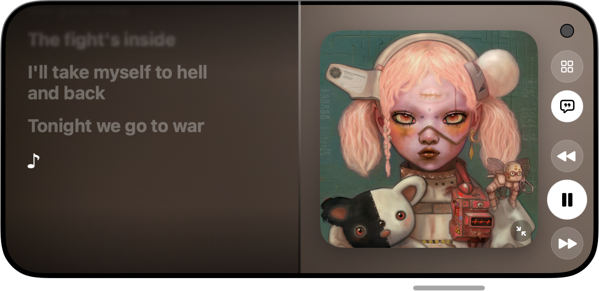
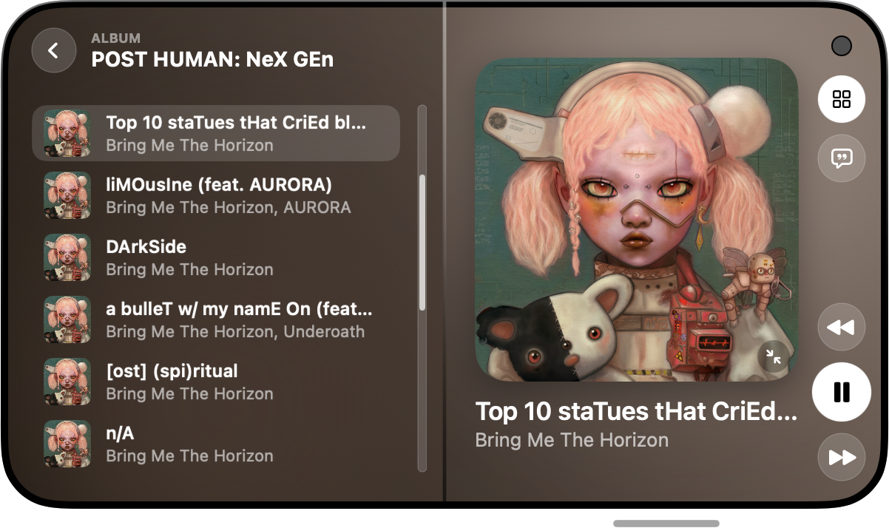
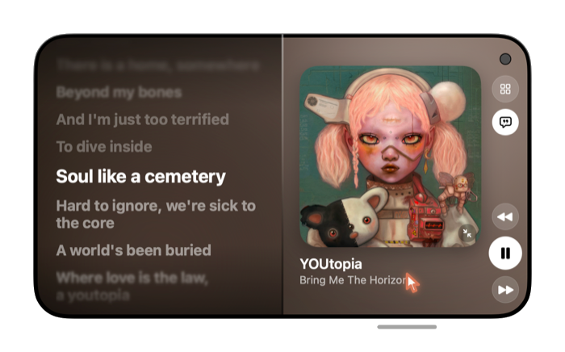

# Duo Player

A floating, iPhone Duo-style Spotify player for macOS. It stays on top of your other windows, folds open into two screens, and controls whatever Spotify is playing through the Spotify Web API.



## Build & run

```bash
./build.sh
open "build/Duo Player.app"
```

On first launch, sign in with Spotify. After a short boot splash the player shows the current track.

## Features

### Now Playing (folded)


The compact, folded view:
- **Album art**: click it (or the ⤢ badge) to unfold.
- **Title / artist**: click to open the list the song is playing from (see *Playing From* below).
- **Live lyric line**: the current synced lyric line, with the next line under it.
- **Scrubber**: drag to seek. Shows elapsed and remaining time.
- **Side controls**: Library (grid), Lyrics (bubble), Previous, Play/Pause, and Next.
- **Grab bar**: the pill under the window switches between the normal and tall sizes.

### Library: Albums


The grid button unfolds a second screen on the left. **Albums** shows your saved albums, with the most recent one large. Click any album to play it.

### Library: Playlists


Your Spotify playlists. Click one to play it.

### Up Next


Spotify's queue, with repeats removed so each song appears once. Click a song to jump to it. Spotify has no "jump into the queue" call, so the app presses Next the right number of times, counted against Spotify's real queue. On repeat-one, clicking the current song restarts it.

### Profile


The person button shows your Spotify account (avatar, name, followers), a **Sign out** button, and your **Top artists**. Click an artist to play them.

### Lyrics


The bubble button shows full synced lyrics on the left screen. The current line is highlighted, and the lines around it fade out. If no lyrics are found automatically, they are searched for by title and artist.

### Playing From (album / playlist)


Clicking the song title lists every track in the album or playlist that is playing. The current track is highlighted, and you can click any row to play it in that context. If Spotify won't share a playlist with developer-mode apps (for example, its own mixes), the list shows the song's album instead. The back arrow returns to the tab you came from.

### Tall size


Drag the grab bar down, or click it, to add one more album row of height, which is closer to the real Duo proportions. Drag it up to go back.

## Notes
- Needs Spotify Premium for playback control (a Web API limit).
- The app runs as a Spotify developer-mode app, so some Spotify-owned playlists can't be read.
